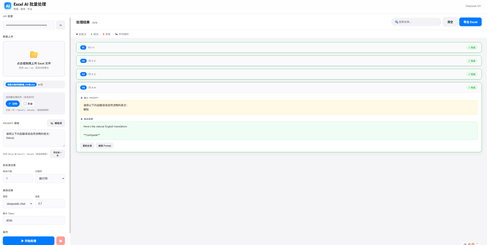

# Excel AI Batch Processor

> 智能 Excel 批量处理工具 · 基于 DeepSeek API  
> Intelligent Excel Batch Processing Tool powered by DeepSeek API

[English](#english) | [中文](#中文)

---

## 中文

### ✨ 项目简介

**Excel AI Batch Processor** 是一款采用苹果设计风格的现代化 Web 工具，可帮助用户通过 DeepSeek 大模型对 Excel 数据进行智能批量处理。

只需上传 Excel、编写 Prompt（支持多列变量 `{Value1}`、`{Value2}`），即可实现翻译、分类、计算、摘要生成等复杂任务，并一键导出结果。

### 🚀 核心功能

| 功能 | 说明 |
|------|------|
| **多列智能处理** | 支持同时选择多列，使用 `{Value1}`、`{Value2}` 独立占位符 |
| **Prompt 模板库** | 内置 9 个专业模板（翻译、关键词提取、情感分析、鸡兔同笼计算等） |
| **批量控制** | 支持重新处理单个批次、编辑 Prompt、搜索结果 |
| **高级参数** | 可调节模型（chat/reasoner）、Temperature、Max Tokens |
| **实时统计** | 显示成功/失败数量、平均处理时间 |
| **一键导出** | 导出带用时统计的完整 Excel 结果 |

### 📸 界面预览

**主界面**

**处理结果示例**


**更多截图**



### 🛠 快速开始

1. **克隆项目**
   ```bash
   git clone https://github.com/385577951/excel-ai-batch-processor.git
   cd excel-ai-batch-processor
   ```

2. **直接打开**
   - 用浏览器打开 `index.html`
   - 或部署到 GitHub Pages（见下方说明）

3. **获取 DeepSeek API Key**
   - 前往 [DeepSeek 平台](https://platform.deepseek.com/) 注册并获取 API Key

### 📖 使用教程

1. 上传 Excel 文件（支持 `.xlsx` / `.xls`）
2. 在列选择器中按顺序勾选需要处理的列
3. 输入或选择 Prompt 模板（支持 `{Value1}`、`{Value2}` 语法）
4. （推荐）点击「预览第一条」验证替换效果
5. 设置批次大小、模型参数后点击「开始处理」
6. 处理完成后可导出结果

### 🔧 技术栈

- **前端**：原生 HTML + CSS + JavaScript（Apple Design System）
- **Excel 处理**：SheetJS (xlsx)
- **AI 模型**：DeepSeek Chat / Reasoner
- **部署**：纯静态，可直接部署到 GitHub Pages / Vercel / Netlify

### 📄 License

本项目基于 [MIT License](LICENSE) 开源。

---

## English

### ✨ Introduction

**Excel AI Batch Processor** is a modern, Apple-designed web tool that enables intelligent batch processing of Excel data using the DeepSeek large language model.

Simply upload your Excel file, write a prompt (with multi-column support via `{Value1}`, `{Value2}`), and let AI handle translation, classification, calculation, summarization, and more — then export the results with one click.

### 🚀 Key Features

| Feature | Description |
|---------|-------------|
| **Multi-column Processing** | Select multiple columns and use `{Value1}`, `{Value2}` placeholders |
| **Prompt Template Library** | 9 professional templates (translation, keyword extraction, sentiment analysis, chicken-rabbit calculation, etc.) |
| **Batch Control** | Retry individual batches, edit prompts, search results |
| **Advanced Parameters** | Adjustable model (chat/reasoner), Temperature, Max Tokens |
| **Real-time Statistics** | Success/failure count + average processing time |
| **One-click Export** | Export complete results with timing data |

### 📸 Screenshots

(Insert screenshots here)

### 🛠 Quick Start

1. **Clone the repo**
   ```bash
   git clone https://github.com/385577951/excel-ai-batch-processor.git
   cd excel-ai-batch-processor
   ```

2. **Open directly**
   - Open `index.html` in any modern browser
   - Or deploy via GitHub Pages (see instructions below)

3. **Get DeepSeek API Key**
   - Register at [DeepSeek Platform](https://platform.deepseek.com/)

### 📖 Usage

1. Upload an Excel file (`.xlsx` or `.xls`)
2. Select columns in order in the column selector
3. Enter or choose a prompt template (supports `{Value1}`, `{Value2}` syntax)
4. (Recommended) Click **"Preview First Row"** to verify replacement
5. Configure batch size and model parameters, then click **"Start Processing"**
6. Export results after completion

### 🔧 Tech Stack

- **Frontend**: Vanilla HTML + CSS + JavaScript (Apple Design System)
- **Excel Parsing**: SheetJS (xlsx)
- **AI Model**: DeepSeek Chat / Reasoner
- **Deployment**: Static files — works on GitHub Pages, Vercel, Netlify

### 📄 License

This project is licensed under the [MIT License](LICENSE).

---

## GitHub Pages 部署说明 / GitHub Pages Deployment

### 中文

本项目为纯静态网站，可直接使用 **GitHub Pages** 免费部署：

1. 将仓库推送到 GitHub
2. 进入仓库 **Settings → Pages**
3. Source 选择 `Deploy from a branch`
4. Branch 选择 `main`（或 `master`），文件夹选择 `/ (root)`
5. 点击 **Save**
6. 等待几分钟后访问 `https://385577951.github.io/excel-ai-batch-processor`

### English

This is a static website and can be deployed for free using **GitHub Pages**:

1. Push the repository to GitHub
2. Go to repository **Settings → Pages**
3. Under "Build and deployment", set Source to `Deploy from a branch`
4. Select branch `main` (or `master`) and folder `/ (root)`
5. Click **Save**
6. Wait a few minutes and visit `https://385577951.github.io/excel-ai-batch-processor`

---

**Made with ❤️ using Apple Design principles**
